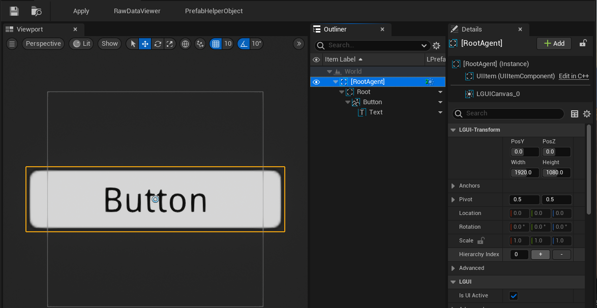
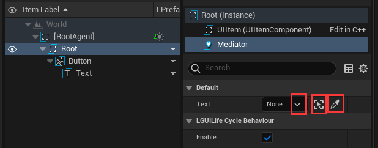
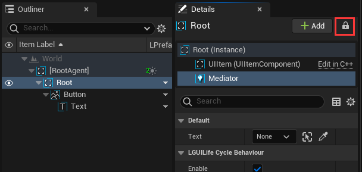
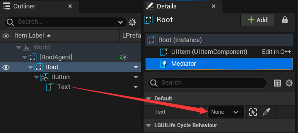

# PrefabEditor

When double click a Prefab, a PrefabEditor window will be opened, it is the good place to edit prefab:  

**[temporary_RootAgent]** is automatically created actor, which is just an temporary root node.  

## Assign actor variable
Sometimes we want to assign an actor variable inside PrefabEditor, we actually can't use these quick methods to choose the desired actor (the three little icon buttons), because it can only choose actors inside current level:  

But how can we do it? Well there is a workaround.  
Check on the little lock button in the Details panel:  

Then drag your actor to the variable area:  
  
That's it.
