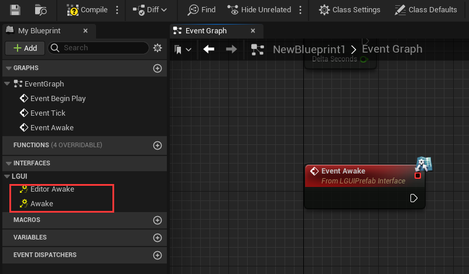
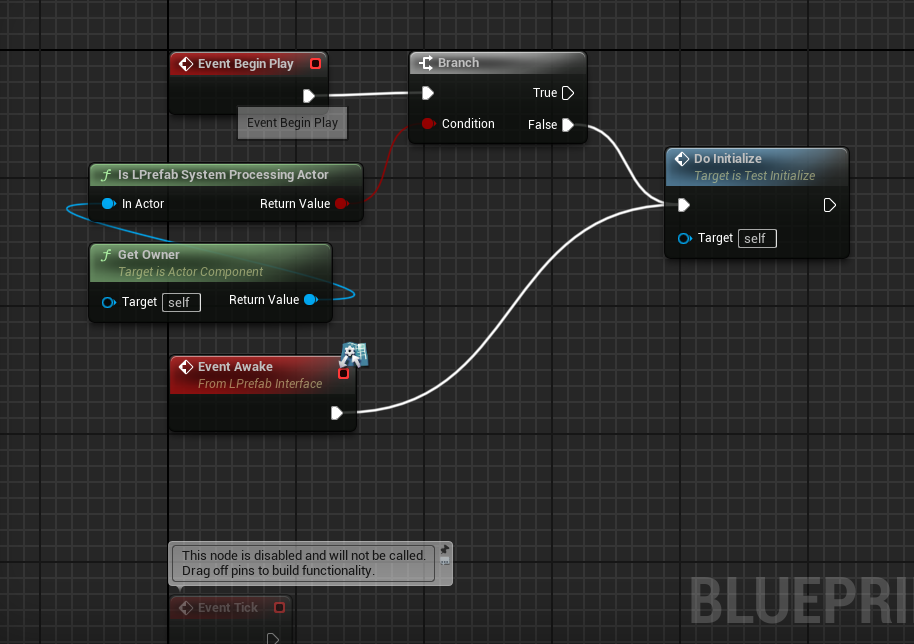
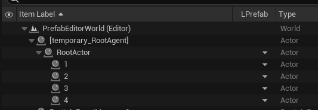

# LPrefabInterface
This interface provide **Awake** function for Actor and ActorComponent, and the **Awake** will be called right after the prefab finish deserialize.  
Open a blueprint Actor or ActorComponent, click on "Class Settings", in the "Implemented Interfaces" area click "Add" button and typein *LPrefabInterface*:

Then two functions will appear on "Interfaces" area:  
**Awake**: Called when LGUIPrefab finish load. This is called late than BeginPlay. 
**EditorAwake**: Same as *Awake* function but only execute in edit mode.

Normally we use "BeginPlay" to do initialization, but when use prefab we need to use "Awake" instead, so is there any way to use them together? The answer is yes, just link nodes like this:

The **Is LPrefab System Processing Actor** is a node provided by LPrefab, that can tell use if the prefab system is still processing the actor, if true then we can use **Awake** to do the initialize work, otherwise use **BeginPlay**.  
 

## Execute order in LPrefab
**Awake** & **Tick** execute order in prefab:
 - Higher in hierarchy will execute earlier, so scripts on root actor will execute the first, and scripts on lowest actor will execute the last.  
 - We can use actor label to control the execute order. Check the screen-shot-image blow, activate "Item Label" as sorting rule, the execute order is from top to bottom as "RootActor->1->2->3->4".  

 - Actor execute first, then execute on component.  
 - **Tick** also follow the same principle.  