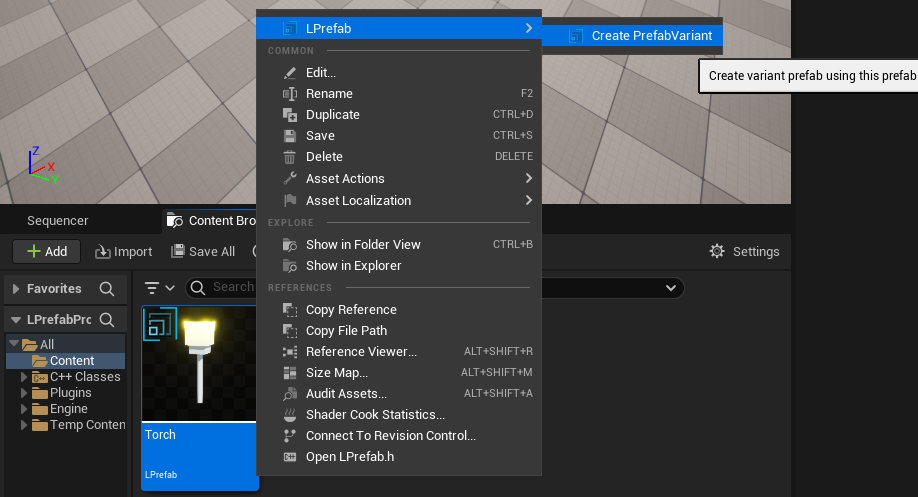
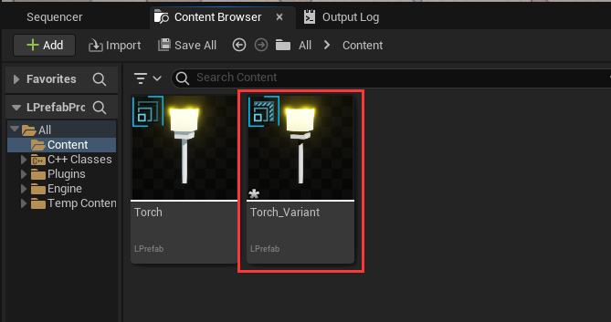
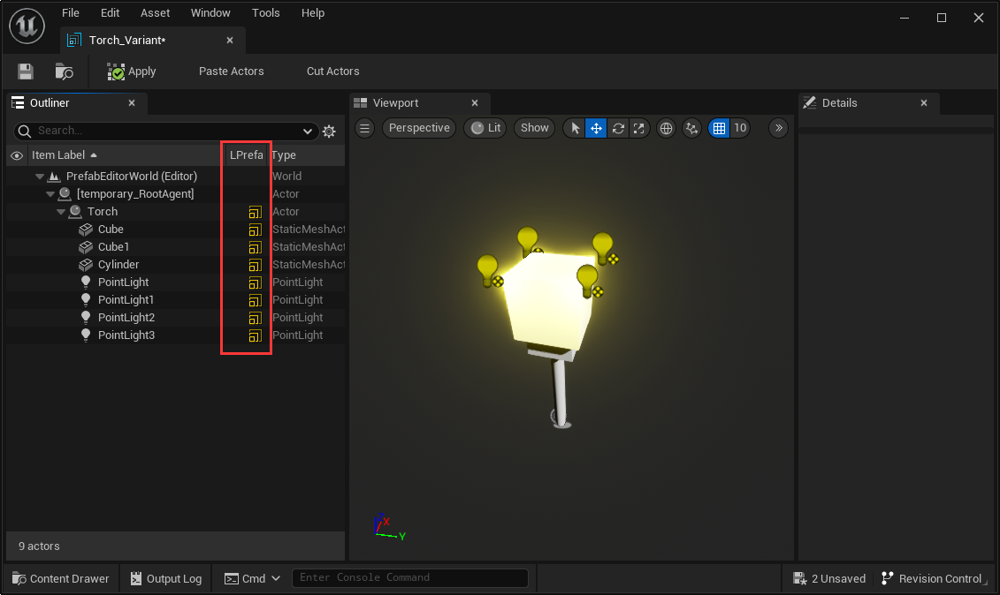

# Prefab Variant
Prefab Variants are useful when you want to have a set of predefined variations of a Prefab.  

For example, you might want to have several different types of Torchs in your game, which are all based on the same basic Torch Prefab. However you may want some Torchs to show different colors, or some to emit sound effects.

We can use the [torch prefab](./../Prefab/index.md) that we created before as example, then we could create several Prefab Variants to :
- Make a Torch emit red light by using a property override.
- Make a Torch carry an item by attaching an additional Actor to its handle.
- Make a Torch with flame-burning sound by adding an actor with AudioSource component.

A Prefab Variant inherits the properties of another Prefab, called the base. Overrides made to the Prefab Variant take percedence over the base Prefab's values. A Prefab Variant can have any other Prefab as its base, even other Prefab Variants.  

## Creating a Prefab Variant
You can right-click on a Prefab asset in the Content Browser and select LPrefab > Create PrefabVariant. This creates a variant of the selected Prefab, which initially doesn't have any overrides. You can open the Prefab Variant in Prefab Editor to begin adding overrides to it.  

## Editing a Prefab Variant
Double click the Prefab Variant to open it in Prefab Editor, the root appears as a Prefab instance with the Prefab icon in LPrefab column. This Prefab instance represents the base Prefab that the Prefab Variant inherits from; it doesn't represent the Prefab Variant itself. Any edits you make to the Prefab Variant become overrides to this base that exists in the Variant:

As with any Prefab instance, you can use prefab overrides in a Prefab Variant, such as modified property values, added child Actors. There are also the same limitations: you cannot reparent Actors in the Prefab Variant which come from its base Prefab. You also cannot remove an Actor or add ActorComponent or remove ActorComponent from a Prefab Variant which exists in its base Prefab.
