# LPrefab (Lex Prefab)
预制体是一组Actor集合，可以保存为资源并在需要的时候还原这些Actor到场景里。

当构建场景的时候经常会需要创建一些Actor组，然后在场景里多次复用或用到另一个场景里。就比如一个火把，火把包含几个静态网格、几个光源、火焰粒子，还可以有脚本。预制体允许我们创建这样的集合，然后保存为预制体资产。然后你可以在Content Browser里选择这个资产，并在场景里创建多个这样的集合实例。

预制体可以修改属性，修改的属性还能同步应用到场景中的其他预制体实例上。其他预制体实例在更新时，只有与原始预制体的属性值相同的属性才会被更新。举个例子，假如有个预制体里面包含了一个黄色的光源，然后修改一个预制体的实例的光源颜色为蓝色，然后修改原始预制体的光源颜色为绿色。那么只有黄色光源的预制体实例才会更新为绿色。这个特性非常有用，因为这样允许我们修改预制体实例中的一部分内容以适用于不同的应用场景，并且也能更新预制体。

## 创建预制体
有两种方式可以创建预制体，我们以创建个火把为例。

### 在场景编辑器中创建预制体
在场景里创建个简单的火把，然后把这些Actor都放到一个根Actor上。火把是由2个盒子+1个圆柱体+4个点光源组成：
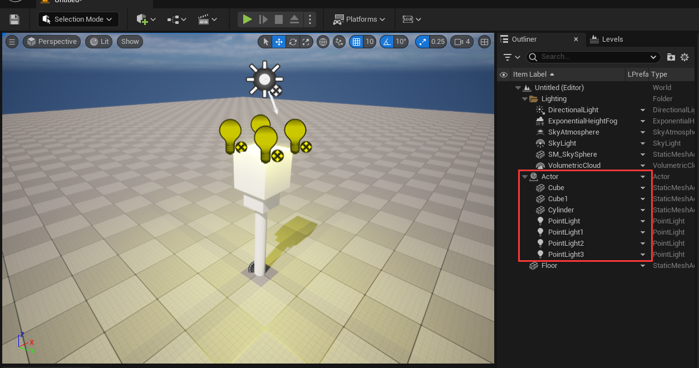
选择根Actor，右键点击LPrefab栏然后在弹出菜单选择**Create Prefab**：  
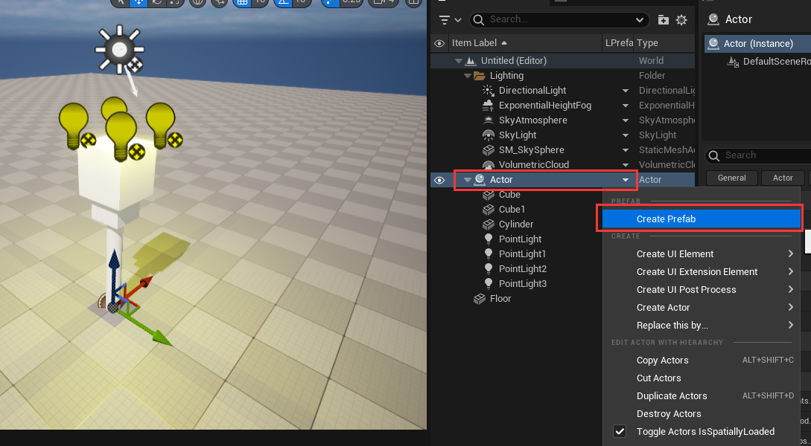
然后会弹出对话框，选择个位置和文件名来保存资源：
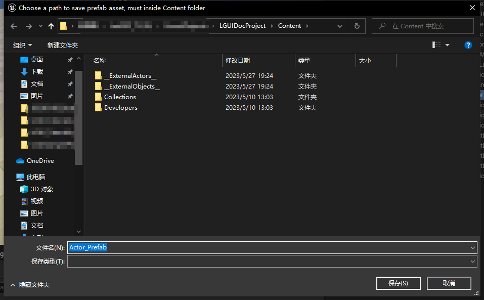
点击“保存”按钮，然后就会在Content目录中创建一个预制体资源，并且场景中这些预制体的Actor在Outliner的LPrefab栏都会显示“Prefab”图标：
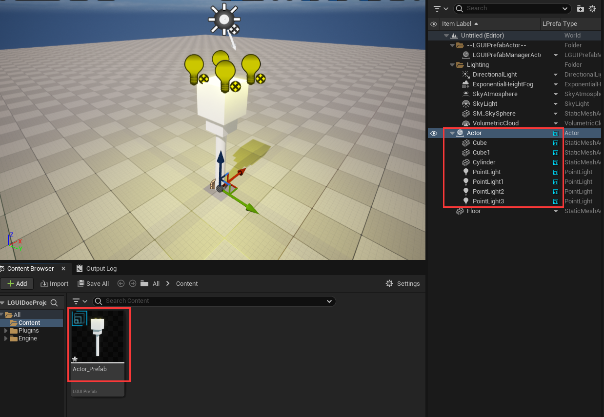
Now we can delete the actors in level. Right-click on LPrefab column of root actor and choose "Destroy Actors":  
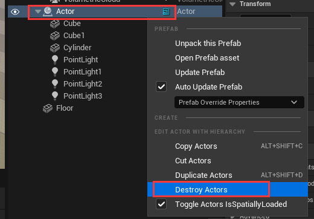

### Create Prefab in Content Browser
Right-click on Content Browser and select LPrefab:
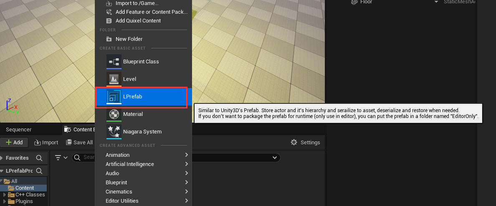
Then a popup window will appear, in this window we can select a type of Actor as the root actor of the Prefab. Just choose the default empty "Actor":
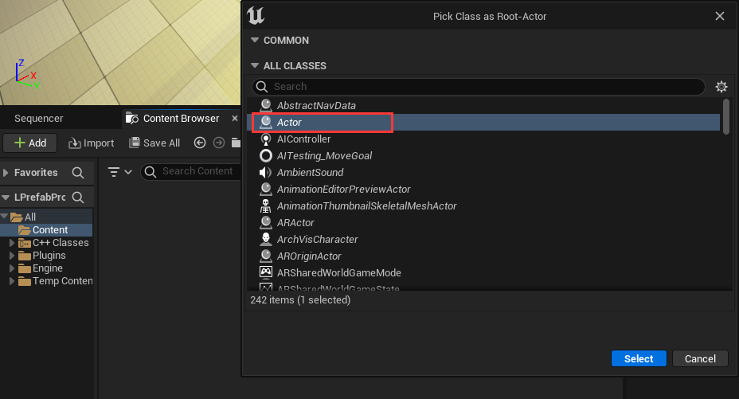 
Then a Prefab asset will be created in Content Browser, name it "Torch":
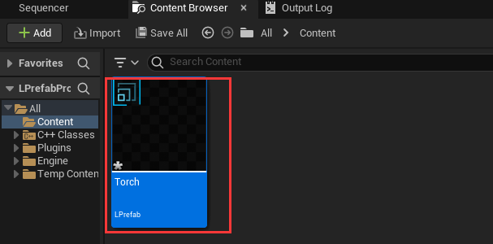
Double click the "Torch" Prefab asset, this will open a Prefab Editor window for us to edit the newly created "Torch" Prefab:
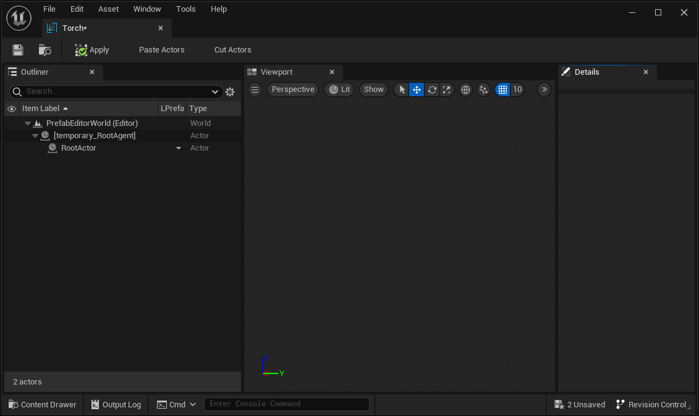
Now we can add shapes and lights to our "Torch", by right click on LPrefab column and click to create these items:
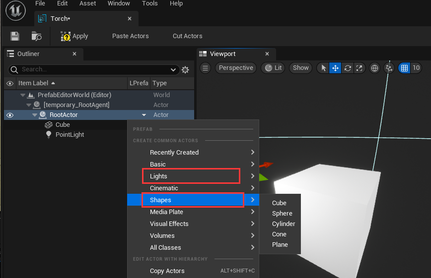
After you finish create the "Torch", hit "Apply" button to save the Prefab:
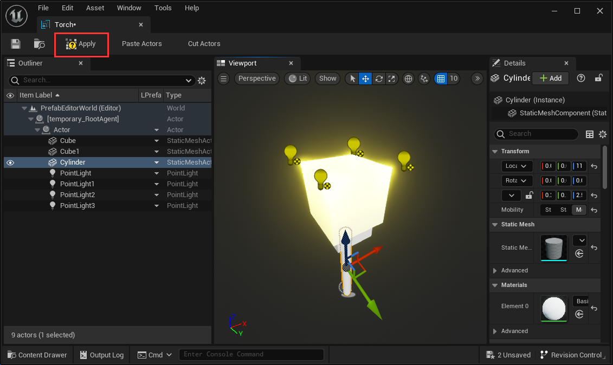
Now you can close the Prefab Editor window.

## Edit Prefab
There are two ways to eidt/modify existing prefabs.  

### Edit Prefab in Prefab-Editor
Just double-click the Prefab asset and will bring-up a Prefab-Editor window:
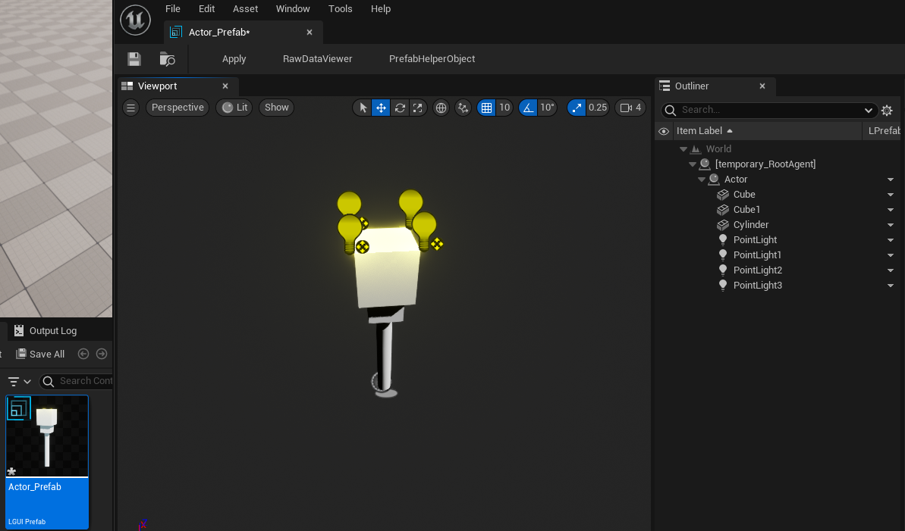
*LPrefab will automatically create a root actor named "[temporary_RootAgent]", as the name means this actor is temporary created just as a root holder.*  
In the Prefab-Editor window, you can do anything you want to edit/modify the prefab. Lets edit something for example.  

Select "Cube" actor and right-click on LPrefab column then select "Create Actor"->"All Actors" then typein "StaticMesh", this will create a StaticMeshActor under "Cube" actor:  
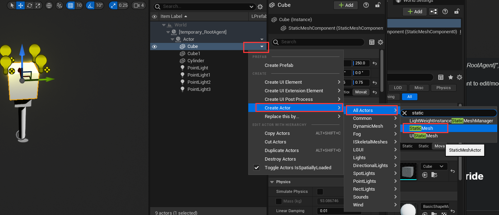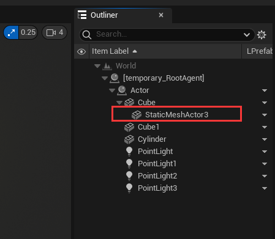
Rename the actor to "Sphere" and assign a sphere static mesh to it:  
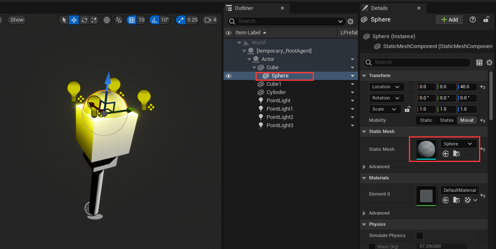

Now the important part, click-on "Apply" button on the left-top size of the editor window:  
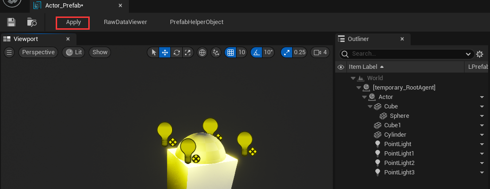

The "Apply" button will save your changed properties to Prefab asset, so always rememeber to hit it.  

See [PrefabEditor](./../PrefabEditor/)

### Edit Prefab in Level-Editor
Drag your Prefab asset and drop it in Level-Editor's viewport, this will create an instance of the Prefab asset:
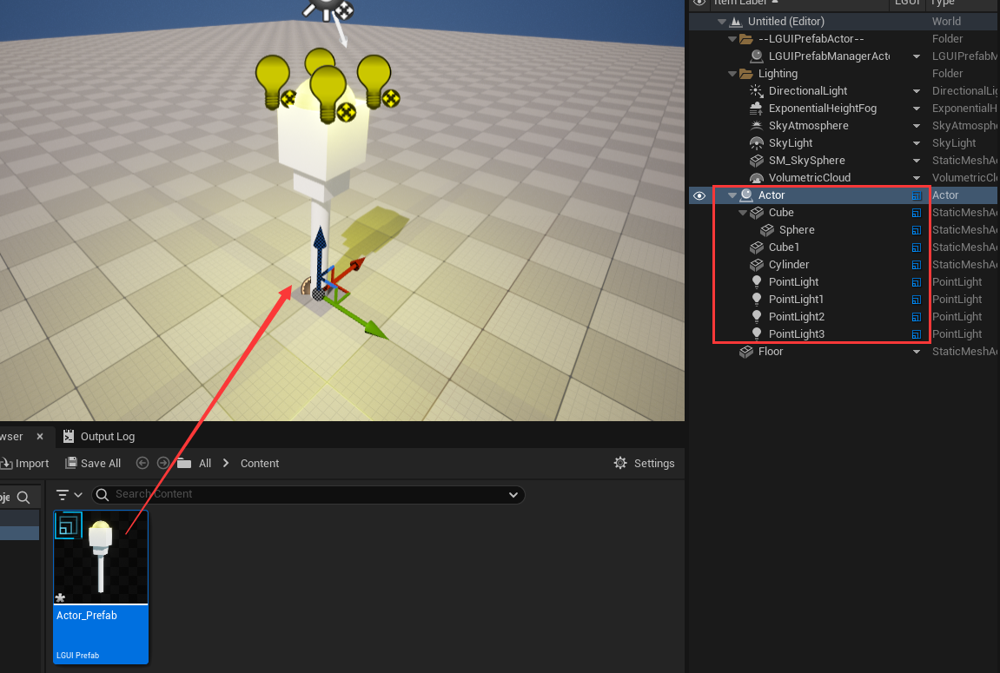
*Note, if you select an actor in Level-Editor then drag-drop the Prefab, then the created Prefab instance will attach to the selected actor.*

When edit a Prefab instance in Level-Editor, LPrefab actually consider it as a Sub-Prefab, so features and limititions are same, see *Nested Prefab and Property Override* section below.

### Delete Prefab in Level-Editor
Select the root actor of your Prefab instance in Level-Editor, then right click on LPrefab column in outliner, and click "Destroy Actors":  
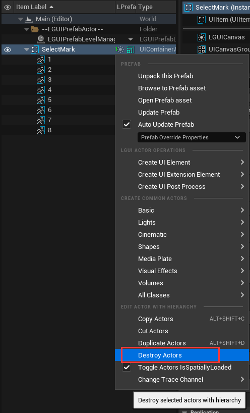

**NOTE!!! The "Destroy Actors" can destroy selected actors with it's attached children actors.**  

## Load Prefab at runtime
LPrefab provide a some function to load it at runtime, you can easily call it in Blueprint and c++:
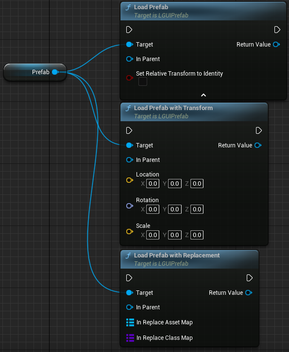
**LoadPrefab**: Most commonly used function
- InParent: Provide a SceneComponent as parent, so the loaded Prefab's root actor will attach to the parent.
- SetRelativeTransformToIdentity: true- Reset the loaded Prefab's root actor's transform value; false- Keep origin value.
**LoadPrefabWithTransform**: Replace the loaded Prefab's root actor's transform value with provided one.  
**LoadPrefabWithReplacement**: This function give us an opportunity to replace the Prefab's referenced assets or class before load the Prefab. Useful in the case that, we create a PrefabA, and a component CompA at the root actor to manage the PrefabA, then we create a CompB which have the same properties as CompA, but with different function implementation, then we can use this function to load PrefabA and replace class from CompA to CompB; But remember, Prefab serialize depend on UProperty, so CompA and CompB must have same UProperty.  
- InReplaceAssetMap: Map from asset to another, maybe a static mesh.  
- InReplaceClassMap: Map from class to another, in the above example, we can map CompA to CompB.

Lets have a test. Create a ActorBlueprint with name "TestLoad", open it in BlueprintEditor, add variable with name "Prefab" and type "LPrefab", assign the Prefab asset we just created above, link the node like the shot:
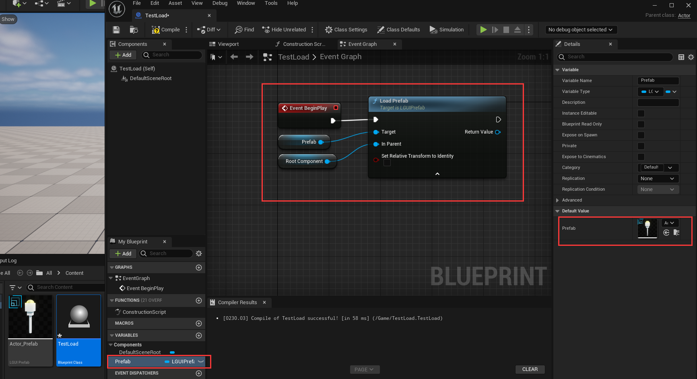
Now drag the actor "TestLoad" to LevelEditor's viewport then hit play, you will see the Prefab is successfully loaded and attach to "TestLoad" actor:
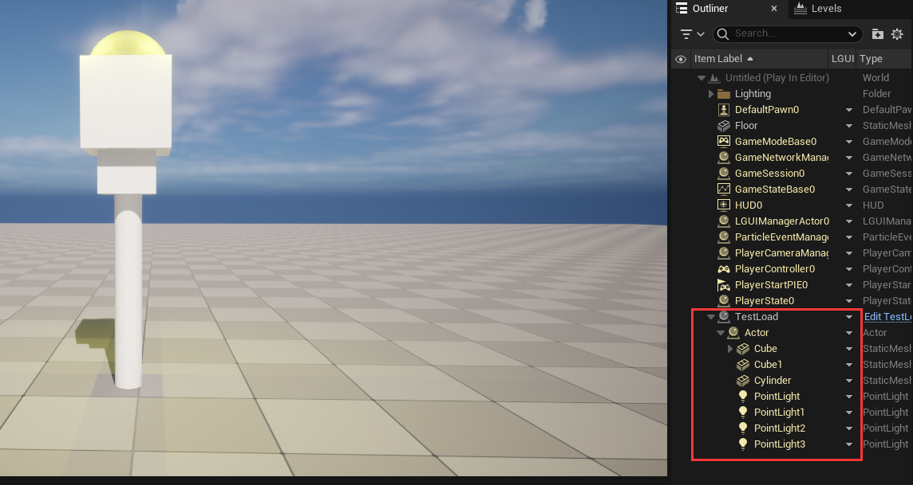

### Initialize when load Prefab at runtime
LPrefab use it's own serialization policy and it is late than "BeginPlay" execution, so properties are not ready when "BeginPlay", so a replacement for "BeginPlay" must use to do the initialization job.  
LPrefab provide a way to achieve this: 
- [**LPrefabInterface**](./../PrefabInterface/): Both Actor and ActorComponent can implement this interface.

Lets have a test. Create a ActorComponent with name "TestInitialize", open it in BlueprintEditor, click on "Class Settings", in the "Implemented Interfaces" area click "Add" button and typein *LPrefabInterface*:
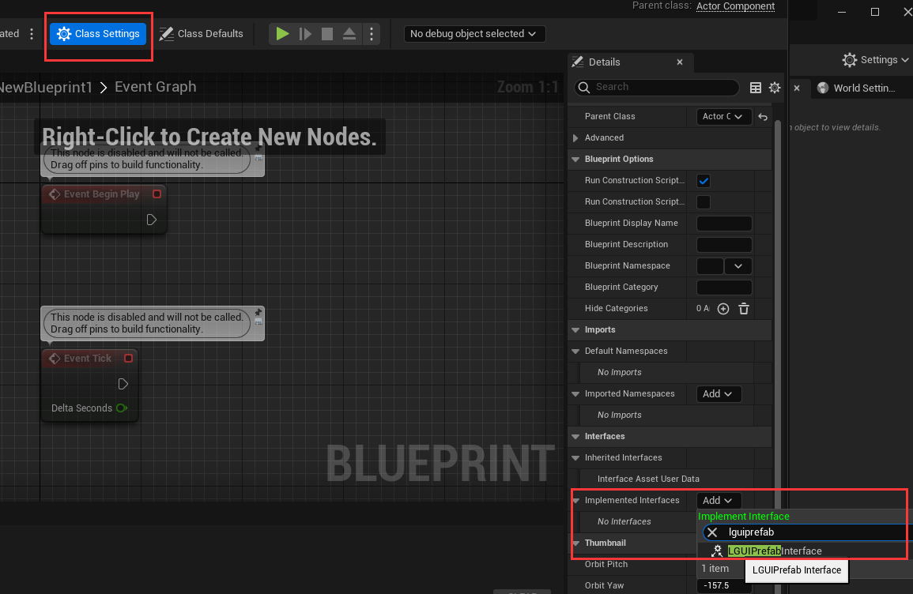
Double click on "Awake" interface function, then drag out from "Event Awake" and link a "PrintString" node:
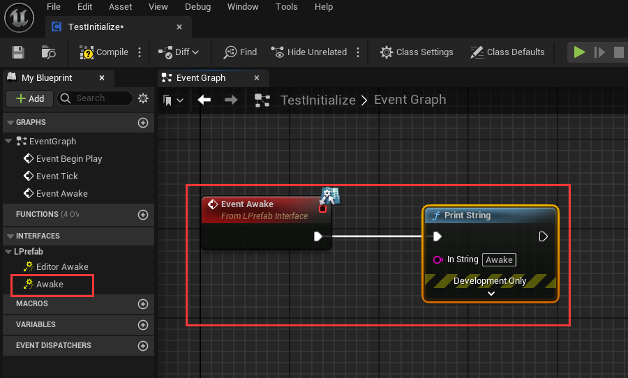
Double click on your Prefab asset to open Prefab-Editor, and drag TestInitialize component to any actor in prefab, then hit "Apply":
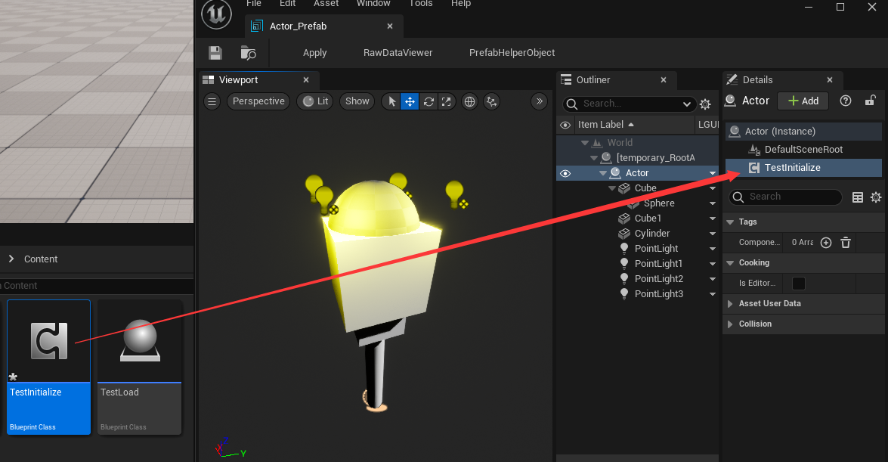
Now hit play and you will see printed info right after the Prefab is loaded.  

### Delete Prefab instance at runtime
Prefab instance is just a collection of actors, so all we need to do is delete these actors. LPrefab provide a simple function to do it "Destroy Actor with Hierarchy", just use it with the loaded prefab's root actor:
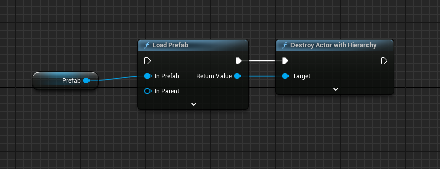

## Nested Prefab and Property Override
Nested Prefab means you can include Prefab instances inside other Prefabs. Nested Prefabs retain their links to their own Prefab Assets, while also forming part of another Prefab Asset.  
How to create a nested Prefab? This is simple, double click on Prefab asset to open a Prefab-Editor, click a actor to select it as parent, then drag another prefab to the Prefab-Editor's viewport, then you will find a instance of Prefab is created inside Prefab-Editor:
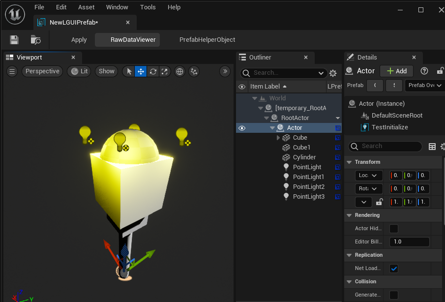
Prefab can maintain it's default property, and track changed property values for later *Apply* or *Revert*. 
For example, if I change the light color to red:
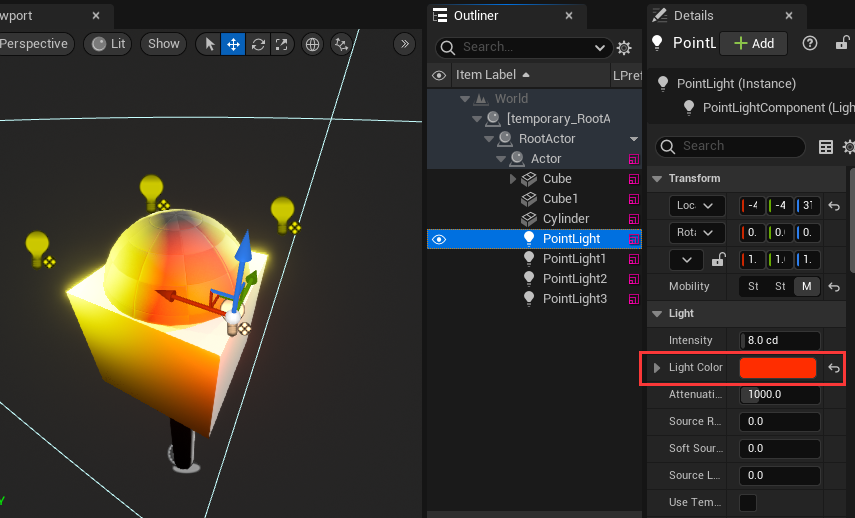
Goto Sub-Prefab's root Actor and right click LPrefab column in outliner, you will find "Prefab Override Properties", click it and you can see the modified property:
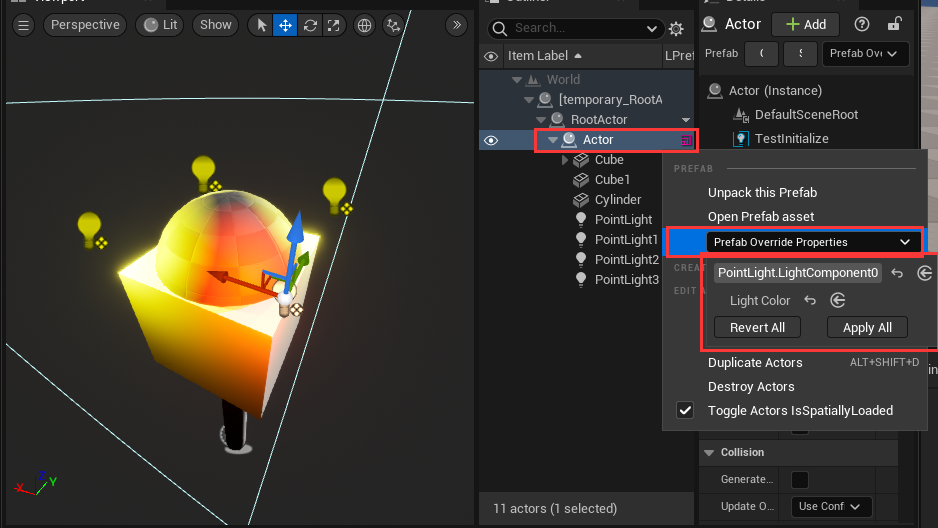
You can *Revert* the modified property to Sub-Prefab's default value, or *Apply* the value to change the Sub-Prefab's default value.  

There are some limitations when edit Sub-Prefab:
- Can't delete or remove Actor.
- Can't delete or remove ActorComponent.
- Can't change Actor's attachement.

If we try to attach a actor to another, a message will showup to prevent it:
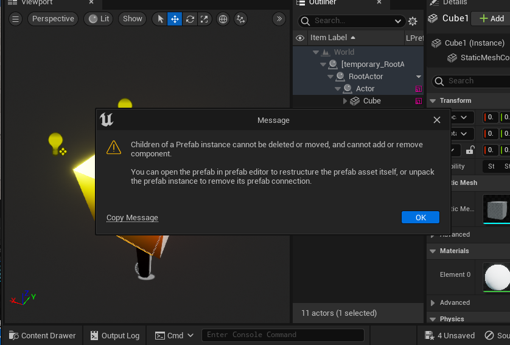

**KNOW LIMITATION**
Actor-Blueprint is not good with Prefab's workflow, so use it at your own risk.
